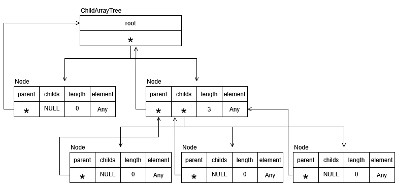

# 2026-03-17 개발 로그

### 작업 목록
1. ChildArrayTree 설계

---
### 작업 1. ChildArrayTree 설계

#### 1. 문제
- Node의 복사생성자, 치환연산자 적용 불가.
#### 2. 원인 분석
- Node가 탐색을 위해 부모 노드 링크를 가짐.
- 복사생성자, 치환연산자에서 복제된 부모 노드의 링크를 알 방법이 없음.
#### 3. 해결방안
- Node의 복사생성자와 치환연산자를 사용 않음.
- ChildArrayTree가 직접 전체를 순회하면서 복사 및 치환.
#### 4. 작업 내용
- ChildArrayTree 메모리맵 작도.

#### 5. 결과
- ChildArrayTree 구현 필요.

---
