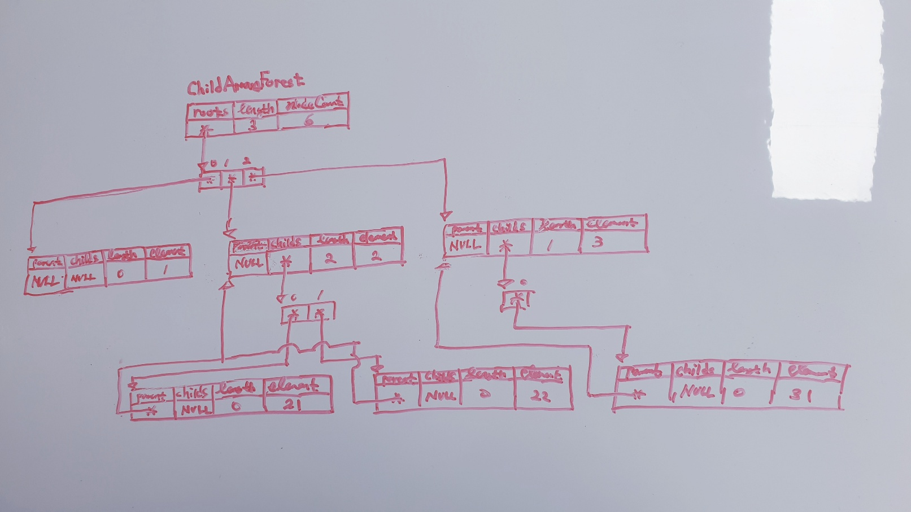

# 2026-03-18 개발 로그

### 작업 목록
1. ChildArrayTree를 ChildArrayForest로 재설계
2. ChildArrayForest의 재귀 설계
3. ChildArrayForest 재귀 로직 분리 검토

---
### 작업 1. ChildArrayTree를 ChildArrayForest로 재설계
#### 1. 문제
- root가 단일 객체가 아니라 배열인데 설계가 미흡
- 메모리도 불안정. childs가 배열을 가리키고 배열 원소로서 child 링크를 해석하는데, 1:N 관계로 표현되지 않음.
#### 2. 원인 분석
- 일반적인 트리는 root가 단일 객체라는 전제가 강했음.
- 메모리도 표면상 동작만 맞추려 했지 실제 트리 구조를 정확히 표현하지 못했음.
- 근본적으로 트리 구조가 아니라 추상적인 이미지 수준에서 설계를 접근한 결과.
#### 3. 해결방안
- root를 roots 배열로 재설계
- 메모리 구조 재정리
#### 4. 작업 내용
- ChildArrayForest 재설계

#### 5. 결과
- ChildArrayForest 구현 필요.

---
### 작업 2. ChildArrayForest의 재귀 설계

#### 1. 문제
- Node에 계층을 순회하는 재귀적 기능을 넣기 어렵다고 판단됨.
#### 2. 원인 분석
- Node가 역참조인 부모 링크를 갖기 때문.
#### 3. 해결방안
- ChildArrayForest에서 기능 추가 시, 공개 메서드 + 내부 재귀 함수로 처리.
#### 4. 작업 내용
- ChildArrayForest의 복사생성자, 치환연산자, 삽입/삭제/탐색 기능 추가.
#### 5. 결과
- 구현 자체는 성공.
- 구조적 문제점 발견 : ChildArrayForest가 기능마다 일일히 내부 재귀 함수를 갖는다면, 지나치게 비대해질 것임.
- 결론, 공통적인 노드 순회 로직을 분리하고, 각각의 처리를 주입하는 형식으로 가야할 것.

---
### 작업 3. ChildArrayForest 재귀 로직 분리 검토
#### 1. 문제
- 지금처럼 ChildArrayForest가 일일히 재귀 함수를 갖는 것보다, 
  공통되는 순회 부분은 Node에 위임하고, 처리만 주입하는 방식이 좋지 않을까 고민.
#### 2. 원인 분석
- 재귀의 실질적인 실행 주체는 Node임. 
- 반면 어떤 처리를 할지 결정하는 제어 주체는 공개 메서드를 가진 ChildArrayForest임.
- 따라서 재귀 실행 위치만 ChildArrayForest에서 Node로 옮겨도, 처리 로직 주입 책임은 그대로 ChildArrayForest에 남음.
- 결과적으로 ChildArrayForest의 메서드 수나 복잡도가 실질적으로 줄지 않음. 단순히 책임 위치만 바뀌는 수준에 그침.
- 범용 분리를 하려면 Node, Context, Process, Output까지 외부에서 주입 가능한 수준으로 변경해야함.
- 이는 라이브러리 본연의 단순한 자료구조 기능보다는 사용자를 위한 확장성 영역에 가까움. 
#### 3. 해결방안
- 현재 단계에서는 ChildArrayForest가 기능별 재귀 함수를 직접 갖는 구조를 유지.
- 나중에 필요시 Node의 공통 순회 기능으로 추출.
#### 4. 작업 내용
- ChildArrayForest 재귀 주체 재검토
#### 5. 결과
- ChildArrayForest가 재귀함수를 가지는 기존의 설계 유지.

---
